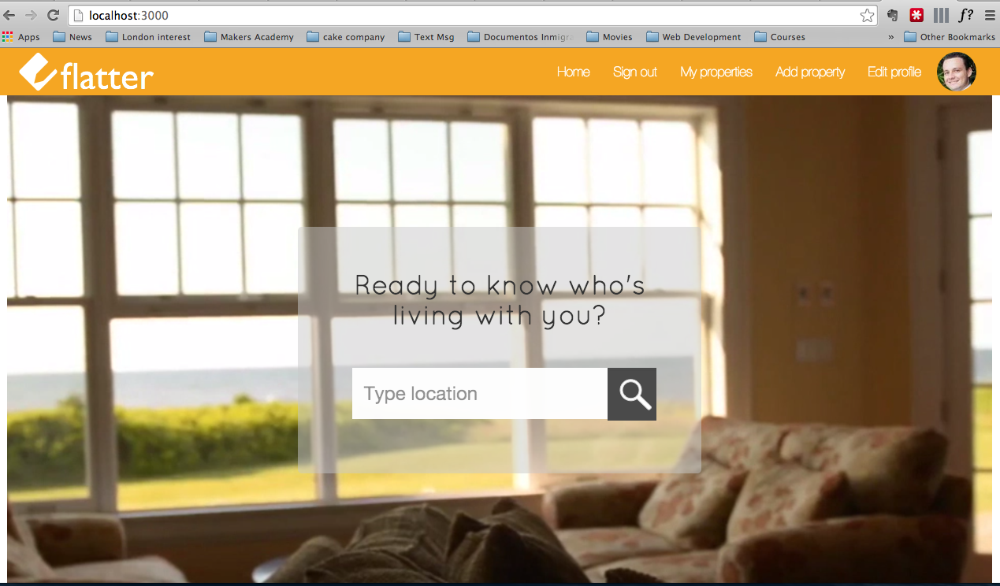
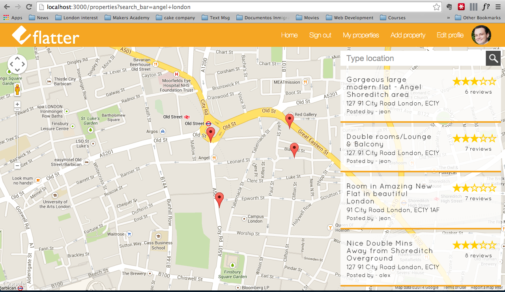
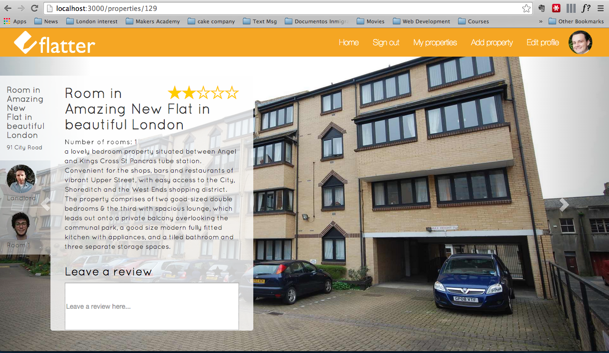
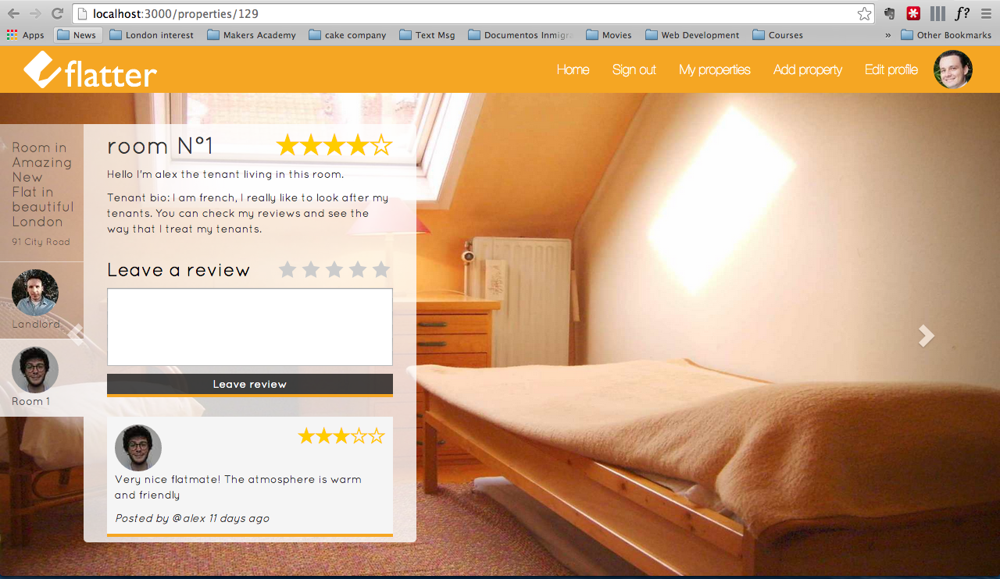

 

Flatter
===========

Final project at [Makers Academy]. This application was build in the two final weeks at the [Makers Academy] Web Development bootcamp.

Flatter is a Web application to help you make the decision of moving to a new place easier. The main purpose of this website is to review properties, landlords and tenants.

check it live on heroku [Flatter](http://flatter-project.herokuapp.com/)

Team members
------------

- [Marco]
- [Jean]
- [Alex]

Technologies used
------------------

- Rails.
- Ruby.
- JavaScript.
- Ajax.
- Postgres.
- RSpec.
- Capybara.
- Devise.
- Geocoder.
- Gmaps4rails.
- Paperclip.
- [S3 AWS].
- Bootstrap.
- HTML5.
- Sass.

How it looks like
-----------------

Home page.

Search an area.

Click on a property.

Click on the room tab.

Heroku test searches and user credentials
---------------------------------------

live app link [Flatter](http://flatter-project.herokuapp.com/)

The purpose of this application is take information from user but before it becomes famous we populated the DB with information so you can navigate and see how it works.

# Available testing user credentials

    username: marco
    password: 12345678

    username: alex
    password: 12345678

    username: jean
    password: 12345678

# Available search examples

All the properties are located near angel and old street so it would be easier for you to search these areas to be able to see some properties. for example:

- Old street, London
- Angel, London

How to setup and run it
-----------------------

    git clone git@github.com:marcoaam/final-project.git
    cd final-project
    bundle install
    bin/rake db:create
    bin/rake db:migrate
    bin/rails server

go to [http://localhost:3000/] on your browser

In order for the app to run you will need to create a [S3 AWS] account, create a bucket named 'getaroom' and then add the unique key id and the secret access key following this steps.

The details will need to be created in a file called secrets.yml:
    
    cd final-project
    touch ./config/secrets.yml

Then copy your details inside of the file in this format:

    development:
      s3_access_key_id: AKIAIqecwvwe
      s3_secret_access_key: IpVHHwevbNFIJdGqxV+M9/

    test:
      s3_access_key_id: AKIAIVC4FwelcmlWLJ
      s3_secret_access_key: IpVHHbwevwevNFIJdGqxV+M

How to test it
----------------

    cd final-project
    rspec

  [Marco]:https://github.com/marcoaam
  [Jean]:https://github.com/jeantroiani
  [Alex]:https://github.com/BobRazoswki
  [Makers Academy]:http://www.makersacademy.com/
  [S3 AWS]:http://aws.amazon.com/s3/
  [http://localhost:3000/]:http://localhost:3000/
